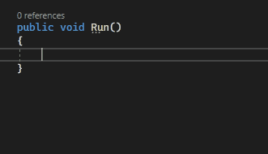

# Auto Surround

Brings VS Code's _Auto Surround_ feature to Visual Studio.

### Supported Languages and File Types

* Batch
* C
* C#
* C++
* Clojure
* CoffeeScript
* CSS
* CUDA C++
* Dart
* Diff
* Docker
* F#
* Go
* Groovy
* Handlebars
* HLSL
* HTML
* Ini
* Java
* JavaScript
* JavaScript React
* JSON
* JSON with Comments
* Julia
* LaTeX
* Less
* Lua
* Makefile
* Markdown
* Objective C
* Objective C++
* Perl
* Perl 6
* PHP
* PowerShell
* Properties
* Pug
* Python
* R
* Razor
* reStructuredText
* Ruby
* Rust
* SCSS
* ShaderLab
* Shell Script
* SQL
* Swift
* TeX
* TypeScript
* TypeScript React
* Visual Basic
* XML
* XSL
* YAML
