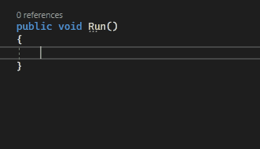

# Auto Surround

Brings VS Code's _Auto Surround_ feature to Visual Studio.

### Supported Languages and File Types

* Agent
* Batch
* C
* C#
* C++
* Clojure
* CMake
* Code Snippets
* CoffeeScript
* CSS
* CUDA C++
* Dart
* Diff
* Docker
* Dotenv
* F#
* Gherkin
* Go
* Groovy
* Handlebars
* HLSL
* HTML
* Ignore
* Ini
* Instructions
* Java
* JavaScript
* JavaScript JSX
* JSON
* JSON Lines
* JSON with Comments
* Julia
* LaTeX
* Less
* Liquid
* Lua
* Makefile
* Markdown
* Objective C
* Objective C++
* Perl
* PHP
* PowerShell
* Prompt
* Properties
* Pug
* Python
* R
* Raku
* Razor
* reStructuredText
* Ruby
* Rust
* SCSS
* ShaderLab
* Shell Script
* SQL
* Swift
* TeX
* TypeScript
* TypeScript JSX
* Visual Basic
* Vue
* XML
* XSL
* YAML
